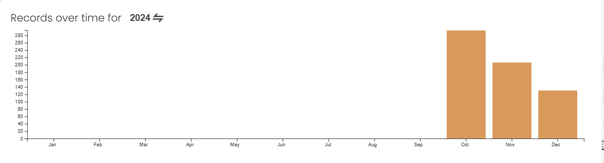
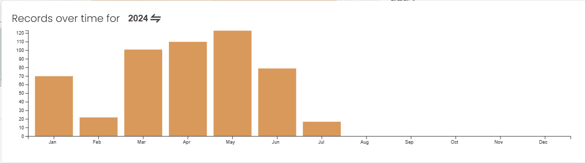
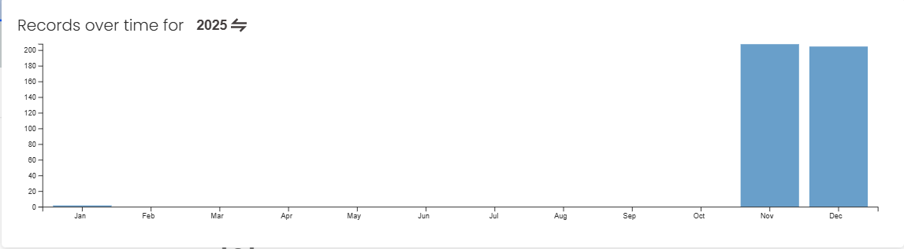
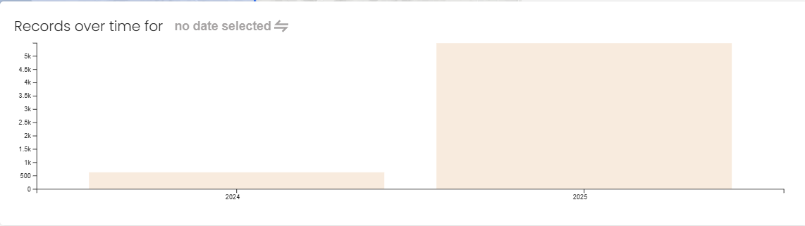
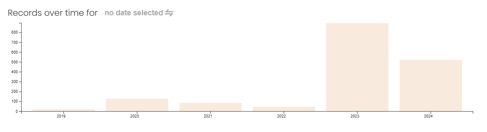
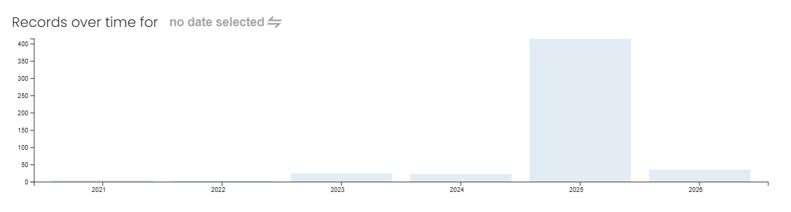
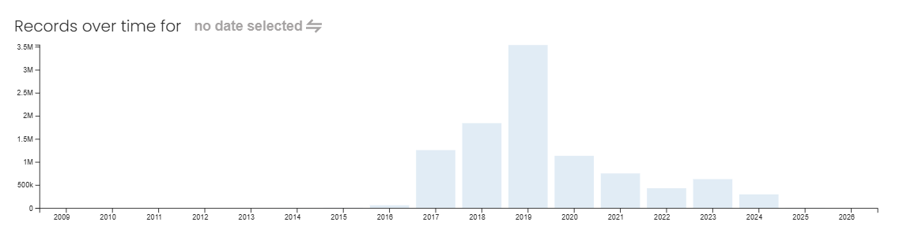
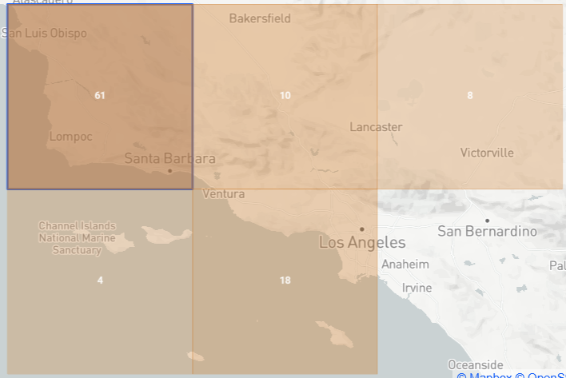
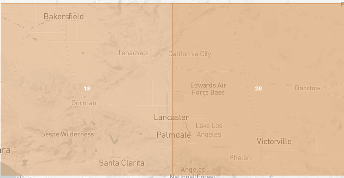
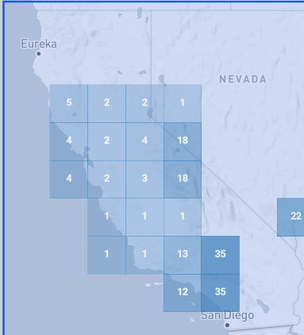

# CSDA Fire Product – Data Availability Report

## 1. Key Points (Summary)

- **Umbra and ICEYE have no temporal intersection over California in this analysis**: ICEYE has 2024 records in Jan–Jul; Umbra has 2024 records in Sep–Dec and additional volume in 2025, so a same-time Umbra+ICEYE pairing is not achievable there.
- **No single fire/date in the examined region has Planet + Satellogic + Umbra + ICEYE + Landsat coverage.**
- **2024 fires tested (including the large PARK fire)**: Planet and Landsat have strong coverage; Umbra, ICEYE, and Satellogic all return **0** scenes over the tested AOIs/date windows.
- **2025 SoCal fires tested (PALISADES, EATON, HUGHES)**: Planet and Umbra have multiple scenes; ICEYE and Satellogic return **0** scenes.
- The strongest multi-source combination actually observed is **Planet + Umbra (plus Landsat from GEE)**.

---

## 2. Archive Availability Over Time (Plots)

### 2.1 Umbra and ICEYE – 2024

### 2.2 Satellogic – 2025

### 2.3 All years (overview)

---

## 3. Archive Availability Maps (Tiles)

### 3.1 Umbra and ICEYE – 2024

### 3.2 Satellogic – 2025

---

## 4. Objective

| Item            | Description                                                                                 |
|-----------------|---------------------------------------------------------------------------------------------|
| Slide layout    | Left: CAL FIRE fire perimeter map (QGIS). Right: post-fire imagery panels.                 |
| Target missions | Planet, Satellogic, Umbra, ICEYE, Landsat (same or closest acquisition date).              |
| Fire data       | CAL FIRE “California Fire Perimeters (all)” dataset.                                       |
| Imagery access  | CSDAP Satellite Data Explorer (Planet, Satellogic, Umbra, ICEYE) and Google Earth Engine.  |

---

## 5. Data Preparation

| Step | Artifact / Tool                 | Output / Notes                                                                 |
|------|---------------------------------|-------------------------------------------------------------------------------|
| 1    | `California_Fire_Perimeters_(all).shp` | Source fire perimeters from CAL FIRE, stored in `data/calfire_perimeters/`.  |
| 2    | `scripts/rank_fires.py`        | Generates `data/candidate_fires_ranked.csv` with `fire_name`, `year`, `acres`, `alarm_date`, `bbox_wgs84`. Filters by year ≥ 2018 and acres ≥ 5000 by default. |

---

## 6. 2024 Fire Candidates Tested

Initial focus: 2024 fires in the Central Valley / Southern California corridor with large burned areas.

| Fire    | Alarm date | Bbox (minLon,minLat,maxLon,maxLat)                  | Time windows tested                 | Planet | Landsat | Umbra | ICEYE | Satellogic |
|---------|------------|------------------------------------------------------|-------------------------------------|--------|---------|-------|-------|------------|
| BRIDGE  | 2024-09-08 | -117.7965,34.1987,-117.6190,34.4219                 | +30 days, extended to ~+60–90 days | Yes    | Yes     | 0     | 0     | 0          |
| LINE    | 2024-09-06 | -117.1851,34.0921,-116.9398,34.2177                 | +30 days, extended to ~+60–90 days | Yes    | Yes     | 0     | 0     | 0          |
| AIRPORT | 2024-09-09 | -117.5707,33.6174,-117.3867,33.7280                 | +30 days, extended to ~+60–90 days | Yes    | Yes     | 0     | 0     | 0          |

These three 2024 fires were removed from the active tracker but remain documented here and in `PROJECT_PLAN.md` as rejected candidates due to lack of Umbra/ICEYE/Satellogic intersection.

In addition, the large **PARK (2024)** fire was checked for availability:

| Fire (year) | Planet   | Landsat | Umbra | ICEYE | Satellogic |
|------------|----------|---------|-------|-------|------------|
| PARK (2024)| 63 scenes| 6 scenes| 0     | 0     | 0          |

---

## 7. Availability Tiles and Histograms (Numeric Summary)

### 7.1 Archive availability by year (qualitative, from histograms)

| Year range | Planet | ICEYE | Umbra | Satellogic | Comment                                 |
|-----------|--------|-------|-------|------------|-----------------------------------------|
| 2019–2020 | High   | Low–M | –     | –          | Early ICEYE, strong Planet              |
| 2021–2022 | Medium | Low–M | –     | Low        | Mixed, not dominant                      |
| 2023–2024 | Medium | High  | Low–M | Medium     | ICEYE strongest here                     |
| 2025      | Low–M  | ~0    | High  | High       | Umbra and Satellogic peaks; ICEYE absent |

Additional 2024-only histograms were examined for the overlapping Umbra and ICEYE regions:

- **Umbra 2024** (`umbra_hist_2024.png`): counts concentrated in **September–December 2024**.
- **ICEYE 2024** (`ice_hist_2024.png`): counts concentrated in **January–July 2024**, with no activity in the late-year months where Umbra is present.

Thus, even though `umbra_2024.png` and `iceye_2024.png` show **spatial** overlap in 2024, the month-by-month histograms demonstrate there is **no temporal overlap** between Umbra and ICEYE in 2024 for this region; a same-time intersection between these two missions in 2024 is not possible in the examined area.

Satellogic 2025 availability (`satellogic_hist_2025.png`) shows:

- A negligible contribution in **January 2025**.
- Most records concentrated in **November and December 2025**.

---

## 8. 2025 Fire Candidates Tested

Based on the histograms (strong Umbra and Satellogic activity in 2025), three 2025 fires were selected from the ranked list and added to `data/study_area_tracker.csv`.

| Fire      | Alarm date | Bbox (minLon,minLat,maxLon,maxLat)              | Time windows tested        | Planet (approx. count) | Umbra (approx. count) | ICEYE | Satellogic |
|-----------|------------|--------------------------------------------------|----------------------------|------------------------|------------------------|-------|------------|
| PALISADES | 2025-01-07 | -118.6859,34.0298,-118.5006,34.1294             | +30 days, extended to ~+60d| ≈49                    | ≈30                    | 0     | 0          |
| EATON     | 2025-01-08 | -118.1621,34.1619,-118.0131,34.2378             | +30 days, extended to ~+60d| ≈67                    | ≈36                    | 0     | 0          |
| HUGHES    | 2025-01-22 | -118.6269,34.4754,-118.5402,34.5814             | +30 days, extended to ~+60d| (present; not counted) | ≈6                     | 0     | 0          |

In all 2025 tests, Planet and Umbra showed archive coverage; ICEYE and Satellogic did not return scenes for these AOIs and date ranges, consistent with ICEYE having no visible 2025 bar in `iceye_hist.png` and Satellogic scenes being confined mainly to Nov–Dec 2025.

---

## 9. Summary of Findings

### 9.1 Method and data artifacts

| Aspect            | Evidence / Location                                   |
|-------------------|-------------------------------------------------------|
| Fire shortlist    | `scripts/rank_fires.py`, `data/candidate_fires_ranked.csv` |
| Tracker           | `data/study_area_tracker.csv`                         |
| Availability viz  | `data/data_availability/*.png`                        |

### 9.2 Per-candidate availability

| Fire (year)        | Planet        | Landsat | Umbra | ICEYE | Satellogic | Notes                                      |
|--------------------|--------------|---------|-------|-------|------------|--------------------------------------------|
| PARK (2024)        | 63 scenes    | 6 scenes| 0     | 0     | 0          | Large 2024 fire, rejected                  |
| BRIDGE (2024)      | Yes          | Yes     | 0     | 0     | 0          | SoCal corridor, rejected                   |
| LINE (2024)        | Yes          | Yes     | 0     | 0     | 0          | SoCal corridor, rejected                   |
| AIRPORT (2024)     | Yes          | Yes     | 0     | 0     | 0          | SoCal corridor, rejected                   |
| PALISADES (2025)   | Yes          | Expected| ≈30   | 0     | 0          | Partial: Planet + Umbra                    |
| EATON (2025)       | Yes          | Expected| ≈36   | 0     | 0          | Partial: Planet + Umbra                    |
| HUGHES (2025)      | Yes          | Expected| ≈6    | 0     | 0          | Partial: Planet + Umbra                    |

### 9.3 Overall

| Aspect                      | Observation                                                                 |
|-----------------------------|-----------------------------------------------------------------------------|
| 5‑mission intersection      | No single fire/date with Planet + Satellogic + Umbra + ICEYE + Landsat observed. |
| 2024 California fires       | Planet + Landsat present; Umbra/ICEYE/Satellogic all 0 for tested AOIs/windows. |
| 2025 SoCal fires            | Planet + Umbra present; ICEYE/Satellogic 0 for tested AOIs/windows.         |
| ICEYE 2025 histogram        | No 2025 bar in `iceye_hist.png` → no 2025 archive entries visible in catalog. |
| Umbra–ICEYE temporal overlap| None in 2024 (ICEYE Jan–Jul, Umbra Sep–Dec) over the examined California region. |
| Strongest observed combo    | Planet + Umbra (plus Landsat from GEE) for 2025 SoCal candidates.          |

